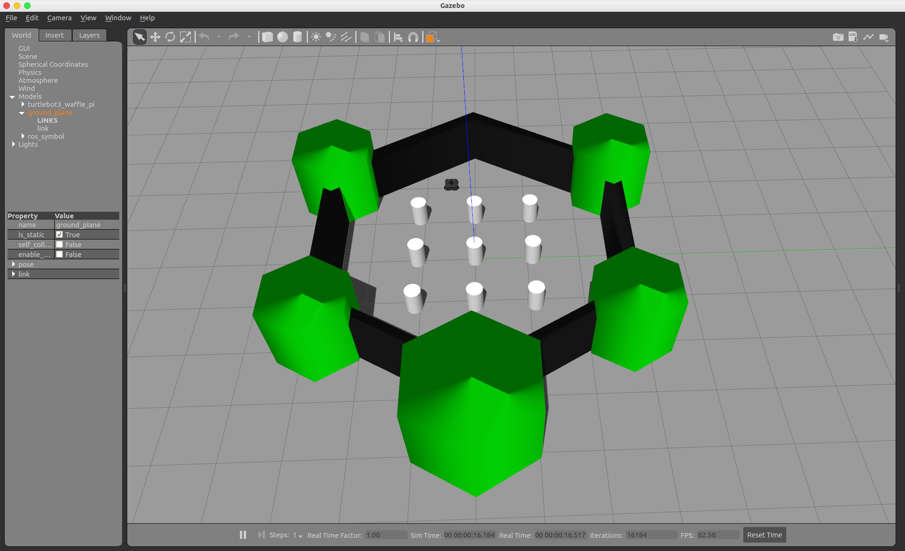
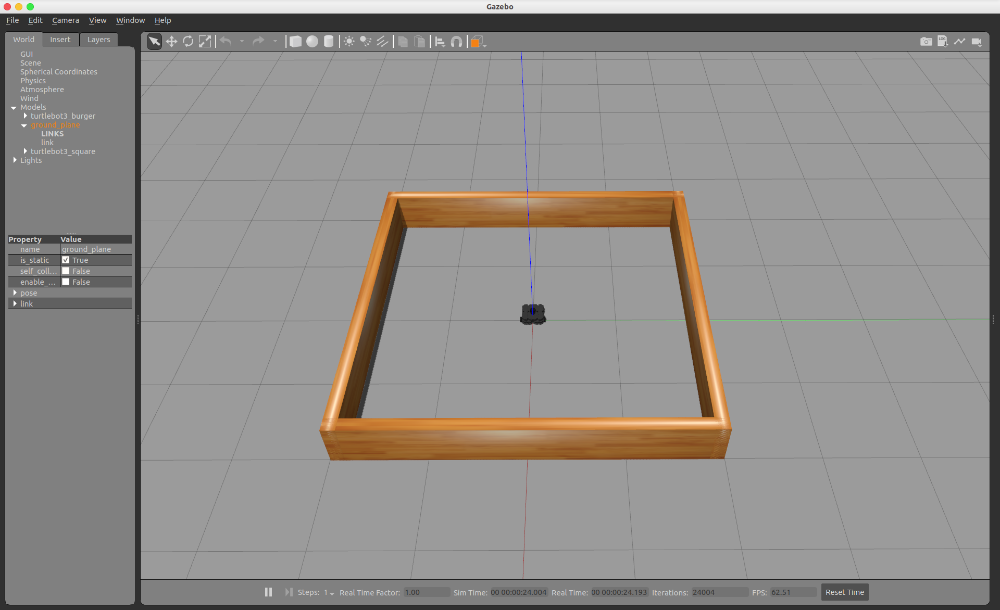
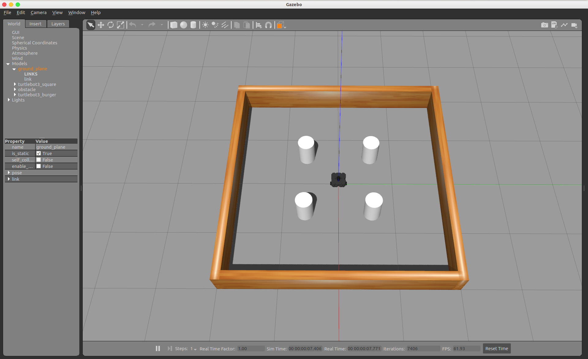

# TurtleBot3 Simulation Gazebo

<br/>

[](https://github.com/ROBOTIS-GIT/turtlebot3/tree/melodic-devel)


## Thanks and Reference

- [turtlebot3](https://github.com/ROBOTIS-GIT/turtlebot3)
- [turtlebot3_msgs](https://github.com/ROBOTIS-GIT/turtlebot3_msgs)
- [turtlebot3_simulations](https://github.com/ROBOTIS-GIT/turtlebot3_simulations)


## 功能包介绍

本仓库为 TurtleBot3 的 Gazebo 仿真功能包，对官方相关代码进行了整合与测试，提供了一个简单可用的功能包集合。

- turtlebot3_bringup         启动文件
- turtlebot3_description  描述文件
- turtlebot3_example 
- turtlebot3_fake
- turtlebot3_gazebo            Gazebo 仿真
- turtlebot3_msgs                 消息文件
- turtlebot3_navigation      导航
- turtlebot3_slam                  SLAM 建图
- turtlebot3_teleop               键盘遥控melodic-devel Status


## 环境配置

.bashrc 配置

```bash
$  gedit ~/.bashrc
```

在末尾处添加如下环境变量

```bash
export TURTLEBOT3_MODEL=waffle_pi
```


## Turtlebot3 机器人模型查看（Rviz）

该功能包支持 Turtlebot3  三款机器人模型，分别为

- burger
- waffle
- waffle_pi

查看机器人模型，Turtlebot3 机器人模型由环境变量决定

```
roslaunch turtlebot3_brp turtlebot3_model.launch
```

如需查看其他型号的机器人模型，可通过修改 .bashrc 中的模型环境变量  TURTLEBOT3_MODEL 或通过如下带参数的启动命令实现

```
roslaunch turtlebot3_bringup turtlebot3_model.launch model:=burger
```


## Turtlebot3 机器人 Gazebo 仿真环境启动

Turtlebot3 机器人 Gazebo 仿真相关文件存放在 turtlebot3_gazebo 功能包中

启动 Gazebo 仿真命令如下

```
roslaunch turtlebot3_gazebo turtlebot3_world.launch
```










## Turtlebot3 SLAM 建图

1 启动 Gazebo 仿真环境

```bash
$  export TURTLEBOT3_Mmelodic-devel StatusODEL=burger
$  roslaunch turtlebot3_gazebo turtlebot3_world.launch
```

2 启动 SLAM 建图节点

```bash
$  export TURTLEBOT3_MODEL=burger
$  roslaunch turtlebot3_slam turtlebot3_slam.launch slam_methods:=gmapping
```

3 启动键盘遥控节点

```bash
$  export TURTLEBOT3_MODEL=burger
$  roslaunch turtlebot3_teleop turtlebot3_teleop_key.launch
```

4 保存地图文件

```bash
$  rosrun map_server map_saver -f ~/map
```


## Turtlebot3 导航（Navigation）

1 启动 Gazebo 仿真环境

```bash
$  export TURTLEBOT3_MODEL=burger
$  roslaunch turtlebot3_gazebo turtlebot3_world.launch
```

2 启动 Navigation 导航节点

```bash
$  export TURTLEBOT3_MODEL=burger
$  roslaunch turtlebot3_navigation turtlebot3_navigation.launch map_file:=$HOME/map.yaml
```

3 调整预估初始位置

使用 rviz 中的 2D Pose Estimate 调节机器人在地图中的初始位姿，使其与 Gazebo 仿真中的基本一致。

4 设置导航点目标

使用 rviz 中的 2D Nav Goal 工具设置目标导航点。


